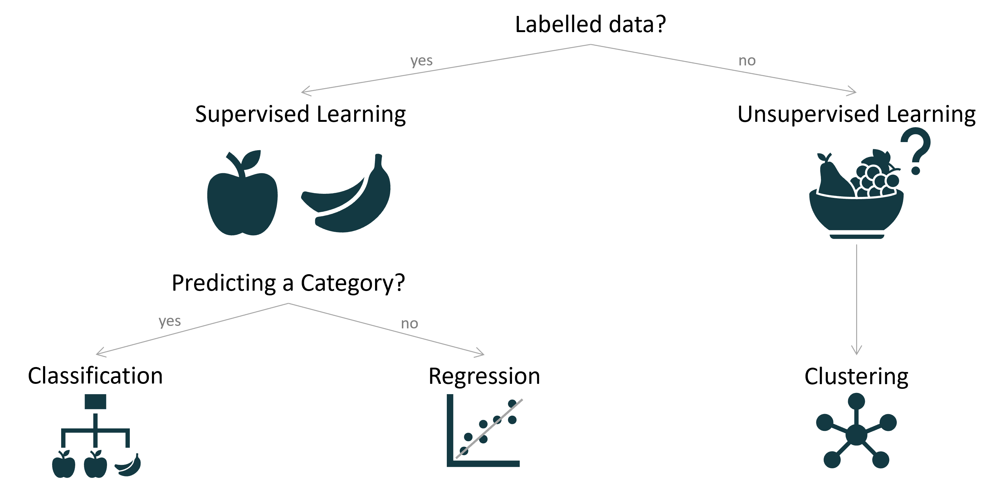

# Motivation 
With the vast amount of data at our disposal we are all looking for ways to use it to our advantage. In the recent years, machine learning algorithms have taken us by storm and are becoming household items in fields ranging from medicine, speech recognition and video games, to name a few. Even though it may sound daunting at first, getting actionable insights from data with the help of machine learning doesn’t have to be on par with developing rockets or baking the perfect soufflé.

ML models can support business decisions (e.g. revenue prediction, customer segmentation), act as a form of automation (e.g. chatbots, music recommendation engines) or many more (e.g. medical diagnoses, image recognition). 
No wonder then why many innovation-oriented companies invest in ML capabilities to leverage their data fully and gain a competitive advantage. 

In this workshop we will create a basic machine learning project in a simple way without needing any prior knowledge of ML or what is happening behind the scenes.

# High Level Workflow of a Machine Learning Project 
The typical high level workflow of a machine learning project can be seen in the following picture. 
First you have  historic data that the model is trained on. The general rule here is the more data the better. Training on a too small dataset can introduce an unwanted bias to the model. 
Next, you will need to perform some data pre-processing which can include data cleaning, feature selection and feature engineering. Once the data is in the desired usable shape it is split into a training and test dataset. The training dataset is used for the model training and the test set for th model evaluation. After training the model, its performance needs to be evaluated. The evaluation can be based on a variety of metrics e.g. accuracy. Most often, model training and evaluation will go round in many cycles until the most optimal model is found. 
This model is then used to predict the outcomes of new data. 

Further Reading: https://towardsdatascience.com/workflow-of-a-machine-learning-project-ec1dba419b94 

The following sections describe the steps in more detail. 

## Data Pre-Processing 
Data pre-processing is often the most time intensive step in a machine learning project. Without proper preparation of the data models can't perform properly or can't be trained at all. There are many things to consider in the pre-processing step. Data cleaning and feature selection are explained in more detail here. Tho, there are other steps to consider during pre-processing for example feature engineering, where new features are created and added to the feature set. 

### Data Cleaning 
Data cleaning is a very important step in the process. Here you will take a deep dive into your data and tidy it up. This can mean a wide range of things spanning from using the correct data types to for example what to do with empty fields - Remove the row? the column? just set to null? ignore? or investigate whether this is just a mishap in the source itself and you can in fact get the data? 
Plenty of questions, right? This is why this step is so important. Having a properly cleaned and understood dataset is the key for making decision further down the line. 

### Feature Selection
Sometimes you will actually not want to use all the features available - maybe some don't actually contribute as much to the model and just reduce the run-times. Feature selection can happen a little later in the process if you perform a feature importance test - but most often you will want to remove some columns from your input dataset. A prime example would be an _id_ column. These are usually not actual feature and can thus be removed. 

## Model Selection 
Deciding on which algorithm to use can be a little tricky and usually you go through iterations and try different ones. But first, we need to understand what kind of machine learning problem we are facing. The following picture gives a brief overview: 

The two main categories are supervised and unsupervised learning. In supervised learning our input data is already labelled and we want to train our model to be able to predict those. If we have a categorical label, e.g. type of fruit, then that would be considered classification. If our target variable is continuous (e.g. a numeric value which could be revenue) then that is regression. 
In case we do not have labels on our data and rather our goal is to generate these, we are in the space of unsupervised learning (clustering). 

Once we've understood the problem the estimators we want to try can be selected. Usually, you end up trying plenty of different ones. A few examples are k-nearest neighbour and tree based classifiers for classification tasks, linear regression and xgboost for regression and k-means clustering for clustering to name a few. Sometimes you might even want to combine your best performing models in an ensemble algorithm. Some algorithms also have implementations for both classification and regression. 

Scikit-learn offers a helper in choosing the right estimator: https://scikit-learn.org/stable/tutorial/machine_learning_map/index.html 

## Model Training
In the model training step the magic finally happens: We train the actual machine learning model(s). But first we need to do one more pre-processing step and divide the dataset into a training and test dataset. This is usually done at random and the training set is most often considerably larger than the test set. A good ratio to start with is 70% as training and 30% as test set. The machine learning model is exclusively trained on the training set. Therefore, the test set functions as unseen data and is used to evaluate the model performance. 
Generally, in machine learning you would also perform n-fold cross-validation. That means that part of the training set gets split into so called validation sets and this split happens n times. The following pictures describes the split into the respective datasets with a 5-fold cross-validation. 

Once the dataset is split, the model can be trained on the training set. The most likely case will be that you will end up trying different algorithms (e.g. logistic regression vs. decision tree) and multiple configurations of these to find the best performing one. The act of testing different configurations of an algorithm is called hyper-parameter testing. During hyper-parameter testing different algorithm specific parameters are tested. For example in a K-nearest neighbour algorithm different values for k (number of neighbours) would be evaluated to find the best performing configuration.

## Model Evaluation 
There are many different metrics that can be used for model evaluation. In the case of a classification problem a confusion matrix can be created (for the sake of this workshop we will focus on classification for this). A confusion matrix visualises the number of true positives, true negatives, false positives and false negatives. From that a number of metrics can be calculated such as: Accuracy, Precision and Recall. The confusion matrix depends on the number of classes and the following picture shows an example of a binary classification confusion matrix. 

Accuracy evaluates the percentage of labels that were correctly predicted. This can be problematic if the dataset is unbalanced. Imagine a dataset where most data point are assigned to class A, if the model then always just predicts class A the accuracy would still be very high even though it never actually predicts class B. 
Recall calculates the true positive rate which are the actual observations that are predicted correctly. In other words if the observation is class A what is the percentage of it being class A over it not being class A. 
Precision identifies the actual number of correctly predicted values that came out positive. In other words, out of all the positive values predicted correctly, how many were actually true. 

A high performance machine learning model has the ability to generalise new input data in a proper way. If it doesn't the two major reasons are underfitting or overfitting. In underfitting the model trained is too simple for the data (left pictures below) e.g. the data is quadratic but the model is linear. This means the model underlies a high bias. Bias are the assumptions made by the model or more technical the error rate of the training data. In the case of underfitting the hypothesis about the data distribution is too simple and therefore the bias is high. 
On the other end of the extreme is overfitting (right pictures below). In overfitting the model is too complex for the data e.g. the data is linear and your model is a high-degree polynomial. This is also called high variance which is the difference between the error rate of the training and test data. If the variance is high overfitting occurs. 
Therefore a high performance machine learning model strives for low bias and low variance. 

    <em>Regression</em>

    

    <em>Classification</em>

Further reading confusion matrix: https://medium.com/low-code-for-advanced-data-science/confusion-matrix-and-class-statistics-f085181a2891, https://rapidminer.com/glossary/confusion-matrix/ 

Further reading under- and overfitting: https://towardsdatascience.com/overfitting-and-underfitting-principles-ea8964d9c45c, 
https://www.geeksforgeeks.org/underfitting-and-overfitting-in-machine-learning/ 

## Production Model
Once a best performing model is found it is time to productionalise it. There are many ways to do that. You might host it in the cloud or simply run it locally. However the model is put into production, in order to generate predictions the trained model is presented with new data and creates predictions based on its trained function. 
Yet, you will most likely still have to go through a data pre-processing step before you feed the data into the model as you might want to remove columns (e.g. ids) which are not known to the model. 
Once in a while it might be useful to re-train the model as well. Sometimes, the data or underlying concept might have shifted a little and re-training it with more recent data could lead to a better performance. Re-training can also be useful if it wasn't trained on a lot of data in the beginning, but now more data is available. A high level overview is visualised in the following picture. 

Now that the model is in production predictive analysis can be performed and valuable actionable insights can be generated. 